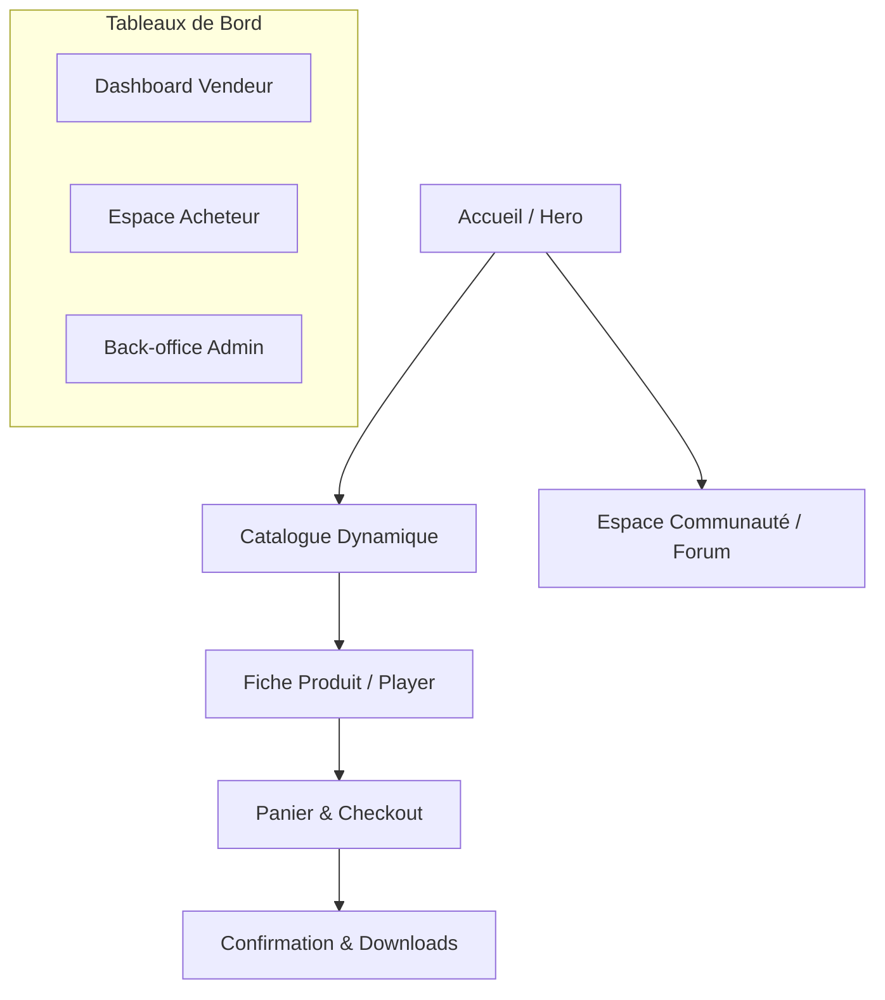

# 🎵 SUMVIBES - Marketplace de Production Musicale

[](https://opensource.org/licenses/MIT)
[](https://nextjs.org/)
[](https://tailwindcss.com/)
[](https://stripe.com/)

> **SUMVIBES** est une plateforme premium dédiée à la vente et l'acquisition de compositions musicales (beats, productions, toplines). L'objectif est de sécuriser les échanges entre compositeurs et artistes tout en offrant une expérience utilisateur fluide et mobile-first.

---

## 🚀 Vision du Projet

SUMVIBES n'est pas qu'une simple boutique de beats. C'est un écosystème complet qui facilite la mise en relation entre les **créateurs** (compositeurs/vendeurs) et les **producteurs de contenu** (artistes, labels, agences).

### Points Forts
- **Expérience Mobile-First** : Pensé pour l'écoute en déplacement.
- **Transparence** : Gestion claire des commissions et des licences.
- **Communauté** : Forum intégré et messagerie directe.
- **Performance** : Streaming audio haute fidélité sans latence.

---

## 🛠️ Stack Technique (Recommandations Sénior)

Pour garantir les performances, la scalabilité et la sécurité demandées :

- **Frontend** : Next.js 14+ (App Router), TypeScript, Tailwind CSS, Radix UI / Shadcn.
- **Backend / Database** : Supabase (PostgreSQL + Auth + Edge Functions).
- **Stockage Audio** : Amazon S3 ou Google Cloud Storage (pour les fichiers haute qualité et previews).
- **Paiements** : Stripe (pour les abonnements et le marketplace split payment).
- **Communication** : SendGrid (emails transactionnels), Resend (dashboarding).
- **Hébergement** : Vercel (Frontend) & Supabase Cloud (Backend).

---

## 📋 Fonctionnalités Clés

### 👤 Pour les Acheteurs (Artistes / Labels)
- 🔍 **Catalogue Avancé** : Filtres dynamiques par Genre, BPM, Mood, Instruments et Prix.
- 🎧 **Player Premium** : Preview audio avec waveform et streaming fluide.
- 🛒 **Achat Sécurisé** : Panier multi-produits, choix de licence simplifié et facturation PDF automatique.
- 📂 **Espace Client** : Historique complet, gestion des licences acquises et téléchargements illimités des fichiers achetés.

### 🎹 Pour les Vendeurs (Compositeurs)
- 📊 **Dashboard Analytique** : Suivi des ventes, revenus et statistiques de lecture.
- 📤 **Gestion de Catalogue** : Upload sécurisé, metadata tagging, et gestion flexible des licences.
- 💰 **Retraits & Commissions** : Système autonome pour demander le virement de ses revenus.
- 💬 **Interactions** : Messagerie directe avec les clients potentiels.

---

## 🏛️ Architecture de la Plateforme



### Arborescence détaillée
- **/catalogue** : Liste des beats, filtres SEO-friendly.
- **/profil/[id]** : Page publique du producteur (Bio, Top beats, Stats).
- **/dashboard** : Gestion personnalisée selon le rôle.
- **/community** : Forum type X/Twitter et petites annonces.

---

## 🔐 Sécurité & Conformité

- **RGPD** : Gestion stricte des consentements et droits d'accès aux données personnelles.
- **HTTPS** : chiffrement SSL systématique sur l'ensemble du domaine.
- **Protection Contre le Piratage** : Watermarking audio sur les previews et liens de téléchargement temporaires sécurisés (Presigned URLs).

---

## ⚙️ Installation (Développement)

```bash
# Cloner le dépôt
git clone https://github.com/grdndev/sumvibes_marketplace_music.git


# Configuration .env et configuration .env.docker
# Copiez .simple.env vers .env et .env.docker puis renseignez vos clés :
# NEXT_PUBLIC_STRIPE_PUBLISHABLE_KEY=...
# SUPABASE_URL=...

# Lancer le docker
docker compose up --build
```

---

## 💼 Équipe & Contact

**Commanditaire** : SAS BE GREAT  
**Contact** : Xavier JARVIS  
📧 [sumgoodthin@gmail.com](mailto:sumgoodthin@gmail.com)  
📞 +590 691 27 20 15

---
*Projet réalisé sous la direction UI/UX pour une expérience sonore et visuelle d'exception.*
